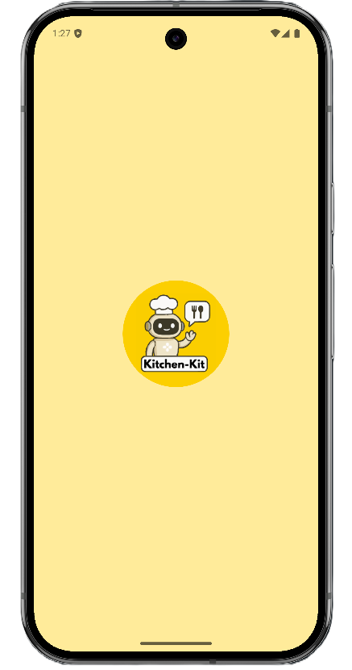
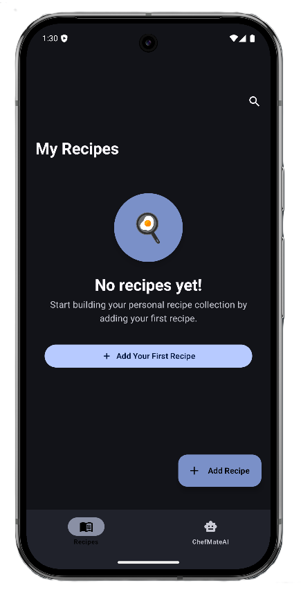
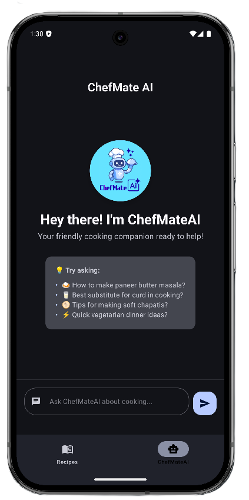
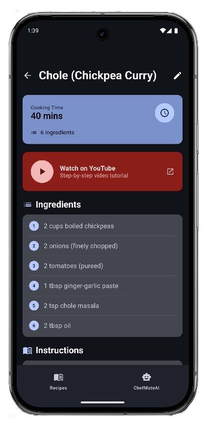
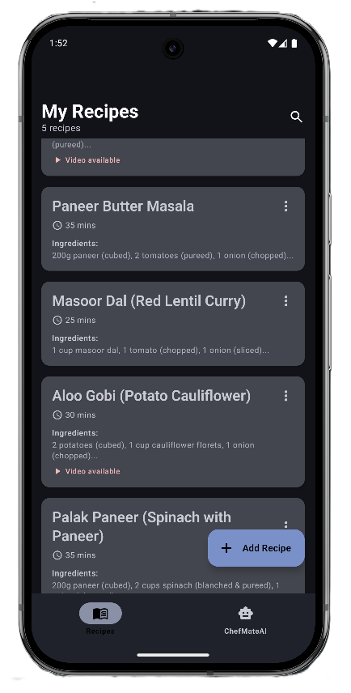
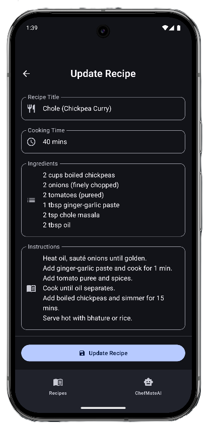

# 🍳 Kitchen-Kit with ChefMate AI

<div align="center">
  
  <br><br>
  
  [](https://android.com)
  [](https://kotlinlang.org)
  [](https://android-arsenal.com/api?level=24)
  
  <br>
  
  **Smart Android recipe app with AI cooking assistant powered by Google Gemini**
  
</div>

---

## ✨ Features

<div align="center">

| 📝 Recipe Management | 🤖 ChefMate AI | 📱 Modern UI |
|:---:|:---:|:---:|
| Create, edit, and organize recipes | Smart cooking assistant | Clean Material 3 design |

| 💾 Offline Storage | 🎥 YouTube Integration | 🔍 Smart Search |
|:---:|:---:|:---:|
| Save recipes locally | Watch cooking videos | Find recipes instantly |

</div>

## 🛠️ Tech Stack

<div align="center">

| Frontend | Backend | AI & Tools |
|:---:|:---:|:---:|
| Jetpack Compose | Room Database | Google Gemini AI |
| Material 3 UI | Local Storage | Hilt DI |
| Navigation Component | MVVM Architecture | Kotlin Coroutines |

</div>

## 📱 Screenshots

<div align="center">

### 📲 App Screens Overview

<table>
  <tr>
    <td align="center">
      
      <br><br>
      <strong>🌟 Splash Screen</strong>
      <br>
      <em>Welcome to Kitchen-Kit</em>
    </td>
    <td align="center">
      
      <br><br>
      <strong>📋 Recipe List</strong>
      <br>
      <em>Browse your collection</em>
    </td>
    <td align="center">
      
      <br><br>
      <strong>🤖 ChefMate AI</strong>
      <br>
      <em>Your cooking assistant</em>
    </td>
  </tr>
</table>

<br>

<table>
  <tr>
    <td align="center">
      
      <br><br>
      <strong>📖 Recipe Details</strong>
      <br>
      <em>Step-by-step instructions</em>
    </td>
    <td align="center">
      
      <br><br>
      <strong>➕ Add Recipe</strong>
      <br>
      <em>Create new recipes</em>
    </td>
    <td align="center">
      
      <br><br>
      <strong>✏️ Edit Recipe</strong>
      <br>
      <em>Modify existing recipes</em>
    </td>
  </tr>
</table>

</div>

## 🚀 Quick Start Guide

<div align="center">

### 📋 Prerequisites

| Requirement | Version |
|:---:|:---:|
| **Android Studio** | Hedgehog+ |
| **Min SDK** | 24 (Android 7.0) |
| **Internet** | For AI features |

</div>

### 🔧 Installation Steps

<div align="center">

| Step | Action | Command/Location |
|:---:|:---:|:---:|
| **1** | 📥 **Clone Repository** | `git clone https://github.com/yourusername/kitchen-kit.git` |
| **2** | 🔑 **Get API Key** | [Google AI Studio](https://makersuite.google.com/) |
| **3** | ⚙️ **Configure Key** | Add to `utils/Constants.kt` |
| **4** | ▶️ **Run App** | Open in Android Studio & Build |

</div>

### 🔐 API Key Setup

```kotlin
// 📁 utils/Constants.kt
const val API_KEY = "your_gemini_api_key_here"
```

<div align="center">
  <strong>🔗 Get your free API key from Google AI Studio</strong>
</div>

## 🤖 ChefMate AI Assistant

<div align="center">

### 🧠 What ChefMate Can Do

| Feature | Description | Example |
|:---:|:---:|:---:|
| 💡 **Recipe Suggestions** | Personalized recommendations | "What can I make with Paneer?" |
| 🍳 **Cooking Tips** | Expert techniques | "How to perfectly sear steak?" |
| 🔄 **Substitutions** | Alternative ingredients | "Replace eggs in baking?" |
| 🛡️ **Food Safety** | Health & safety advice | "How long to store leftovers?" |

<br>

**⚠️ Note: ChefMate responds only to cooking and food-related questions!**

</div>

## 📁 Project Architecture

<div align="center">

```
📦 Kitchen-Kit
📂 data/ --------------> # Room database & repositories
📂 domain/ --------------> # Business logic & use cases  
📂 presentation/ -------------> # ViewModels & UI state
📂 ui/ ---------------------> # Jetpack Compose screens
📂 di/ -------------------> # Hilt dependency injection
📂 utils/ -------------> # Constants & helper functions
```

</div>

## 🏆 Key Highlights

<div align="center">

| 🎯 Clean Architecture | 🚀 Modern Tech Stack | 🎨 Beautiful UI |
|:---:|:---:|:---:|
| MVVM Pattern | Latest Android APIs | Material 3 Design |
| Separation of Concerns | Jetpack Compose | Intuitive Navigation |
| Testable Code | Kotlin Coroutines | Smooth Animations |

</div>

## 📄 License

<div align="center">

```
📜 MIT License
Feel free to use this project for learning and development
```

**🔓 Open Source • 🤝 Community Driven • 📚 Educational**

</div>

---

<div align="center">
  <br>
  
  ### 🍳 **Made with ❤️ for cooking enthusiasts** 🍳
  
  <br>
  
  **⭐ Star this repository if you find it helpful! ⭐**
  
  <br>
  
  [](https://github.com/yourusername/kitchen-kit/stargazers)
  [](https://github.com/yourusername/kitchen-kit/network/members)
  
</div>
